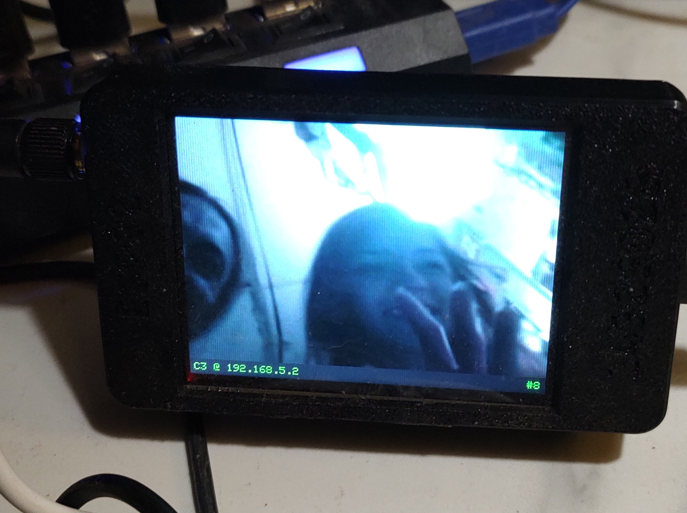
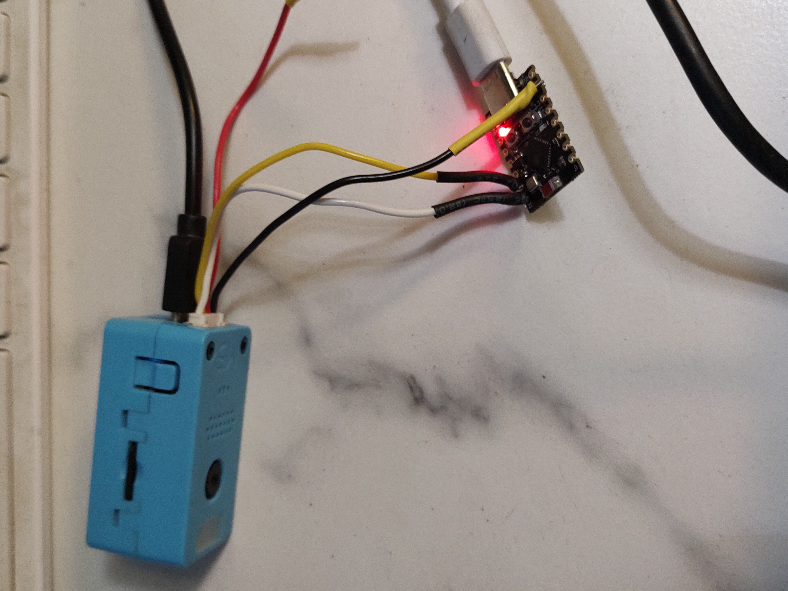
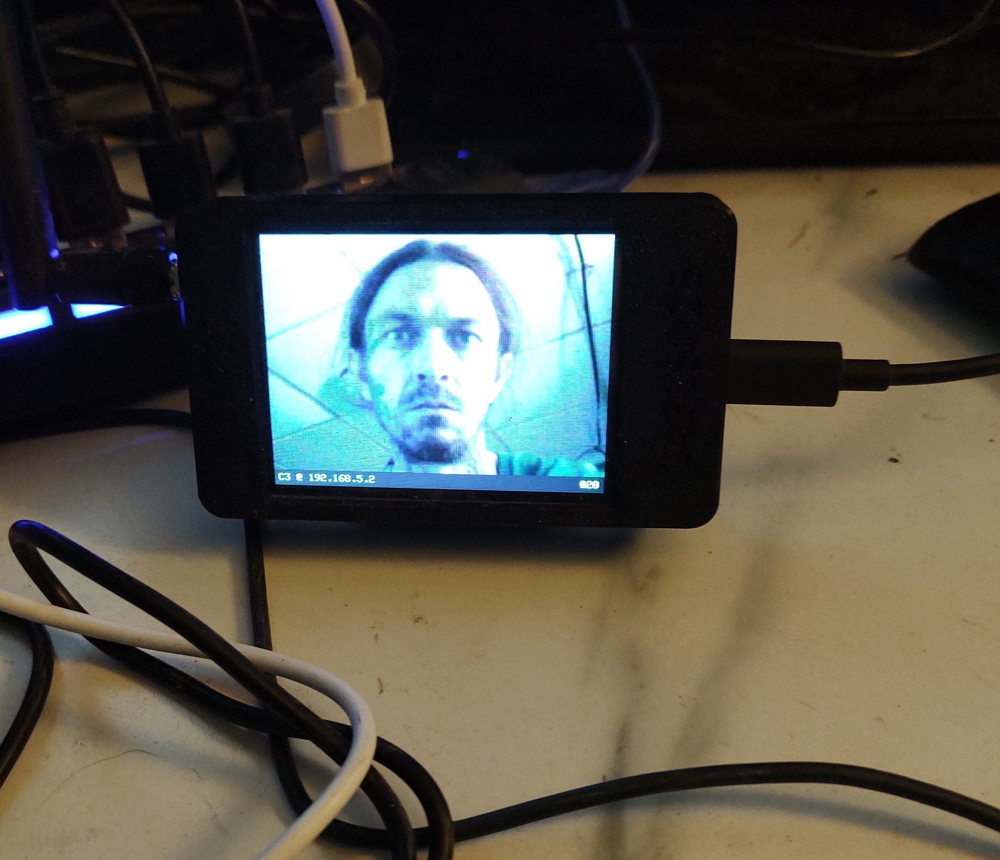

# M5StickV Snap Camera + Wireless Display System

A manual snapshot camera built on the [M5Stack StickV](https://docs.m5stack.com/en/core/stickv), paired with an ESP32-C3 relay and an ESP32-2432S028R (CYD) display receiver. Press a button on the StickV and the photo appears on the CYD screen wirelessly within seconds.

---

## What It Does

- **Press Button A** (front button) → takes a photo, white LED flashes, photo saves to SD card AND transmits wirelessly to the CYD display
- **Press Button B** (side button) → attempts to show last saved photo on LCD *(see Known Issues)*
- Photos auto-increment on SD card (`img_0000.jpg`, `img_0001.jpg`, ...)
- CYD displays each new photo full-screen (320×240) as it arrives
- CYD shows status bar with C3 relay IP and photo count

---

## System Architecture

```
┌─────────────┐  Grove UART  ┌─────────────┐  WiFi (SoftAP)  ┌─────────────┐
│  M5StickV   │─────────────▶│ ESP32-C3    │────────────────▶│ CYD Display │
│  (camera)   │  115200 baud │ (relay)     │  HTTP /latest.jpg│ (receiver)  │
│  K210+OV7740│              │ Super Mini  │                  │ ESP32+ILI9341│
└─────────────┘              └─────────────┘                  └─────────────┘
  Saves to SD                  Serves JPEG                    Decodes + shows
  Sends over UART              at /latest.jpg                 photo full-screen
```

---

## Hardware

| Component | Part | Role |
|---|---|---|
| Camera | M5Stack StickV | Captures photos, sends over Grove UART |
| Relay | ESP32-C3 Super Mini | Receives JPEG via UART, serves over WiFi |
| Display | ESP32-2432S028R (CYD) | Creates WiFi AP, polls C3, shows photos |
| Storage | MicroSD (FAT32) | Photos saved locally on StickV |

---

## Photo Output

- **Location:** `/sd/photos/img_0000.jpg`, `img_0001.jpg`, ...
- **Resolution:** QVGA (320×240)
- **Format:** JPEG, quality 85
- Filenames auto-increment — no duplicates across sessions

---

## Wiring (StickV Grove → C3 Super Mini)

| Grove Wire | StickV Pin | C3 GPIO | Notes |
|---|---|---|---|
| White | CONNEXT_A / pin 35 (TX) | GPIO20 (RX) | **Data line** |
| Black | GND | GND | Ground |
| Red | 3.3V | — | Leave unconnected |
| Yellow | CONNEXT_B / pin 34 (RX) | — | Not needed |

> **Note:** White is TX on StickV, not Yellow. Connect White → C3 GPIO20.

---

## Network

| Device | Role | SSID | IP |
|---|---|---|---|
| CYD | WiFi Access Point | `StickVCam` (open) | 192.168.5.1 |
| C3 | WiFi Station | connects to CYD AP | 192.168.5.2 (DHCP) |

No router required. The CYD is the AP. No passwords to enter — all hardcoded.

---

## Firmware Setup

### 1 — Flash MaixPy to StickV
```bash
pip install kflash
python3 kflash.py -p /dev/ttyUSB0 -b 1500000 maixpy_v0.6.3_m5stickv.bin
```

### 2 — Upload camera script to StickV
Upload `main.py` as `/flash/boot.py` via raw REPL or any MaixPy tool.

### 3 — Flash C3 relay (PlatformIO)
```bash
cd StickVRelay_C3
pio run --target upload
```

### 4 — Flash CYD display (PlatformIO)
```bash
cd StickVCam_CYD
pio run --target upload
```

### Boot order
1. Power CYD first (it creates the WiFi AP)
2. Power C3 (auto-connects to CYD AP)
3. Power StickV (ready to shoot immediately)

---

## Project Structure

```
StickV/
├── main.py                  ← StickV camera firmware (uploads to /flash/boot.py)
├── maixpy_v0.6.3_m5stickv.bin
├── StickVRelay_C3/          ← ESP32-C3 PlatformIO project
│   ├── platformio.ini
│   └── src/main.cpp
├── StickVCam_CYD/           ← CYD display PlatformIO project
│   ├── platformio.ini
│   └── src/main.cpp
└── VBackup/                 ← Working restore point (SD-only camera, no UART)
```

---

## Known Issues

### StickV LCD is blank
The LCD does not display a live preview. `lcd.display()` is called without error but no image appears. Photos save and transmit correctly — the blank screen does not affect functionality.

### Photos stop when C3 is connected but not yet online
If the C3 is wired via Grove but hasn't booted yet, the first few button presses may not save photos. Reboot the StickV after C3 is running to resolve.

---

## Future Ideas

- [ ] Motion/PIR trigger for automatic security camera mode
- [ ] Auto-detect motion via KPU or frame differencing on StickV
- [ ] ESP32-C3 to push photo notification to a phone or MQTT broker
- [ ] Timelapse mode
- [ ] Fix LCD preview

---

## Photos

### The System


### Hardware Close-up


### In Action

